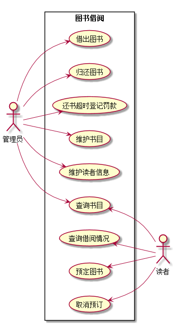
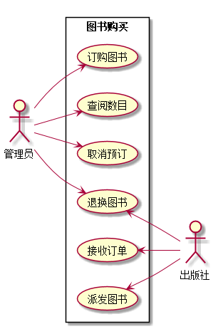

# 实验一：业务流程建模
<table>
<tr>
<td>学号</td>
<td>班级</td>
<td>姓名</td>
<td>照片</td>
</tr>
<tr>
<td>201510414309</td>
<td>15级软件三班</td>
<td>林榆佳</td>
<td></td>
</tr>
</table>

## 1. 图书管理系统的用例关系图

### 1.1 用例图PlantUML源码如下：

``` usecase
@startuml
left to right direction
skinparam packageStyle rectangle
actor 读者
actor 管理员
rectangle 图书借阅 {
   管理员-->(借出图书)
   管理员-->(归还图书)
   管理员-->(还书超时登记罚款)
   管理员-->(维护书目)
   管理员-->(维护读者信息)
   管理员 --> (查询书目)
  (查询书目) <--读者
  (查询借阅情况) <--读者
  (预定图书) <--读者
  (取消预订) <--读者

}
newpage
left to right direction
actor 管理员
actor 出版社
rectangle 图书购买 {

  管理员-->(订购图书)
  管理员-->(查阅数目)
  管理员-->(取消预订)
  管理员-->(退换图书)
  (接收订单) <--出版社
  (派发图书) <--出版社
  (退换图书) <--出版社


}
@enduml
```


### 1.2. 用例图如下：

参见图7.6




## 2. 参与者说明：

###     2.1 图书管理员

主要职责是：对图书进行维护以及对图书的借阅管理，书籍采购等。

###     2.2 读者

主要职责是：借阅图书，归还图书

###     2.3 出版社

主要职责是：根据图书馆订单提供相应图书，以及对一定期限内有问题图书的退换处理。

##     3. 用例规约表

## 3.用例规约表
### 3.1 "借出图书"用例
| | |
|:------:|:------:|
|用例名称|借出图书|
|参与者|图书管理员（主要参与者）、借阅者（次要参与者）|
|前置条件|图书管理员已被识别和授权|
|后置条件|存储借书记录，更新库存数据，所借图书状态为借出|
|主事件流|1.图书管理员将读者借书卡提供给系统；<br>2.系统验证读者身份和借书条件；<br>3.图书管理员将读者所借图书输入系统；<br>4.系统记录借书信息，并且修改图书的状态和此书的可借数量；<br>5系统累加读者的借书数量；<br>6.重复3~5，直到图书管理员确认全部图书登记完毕；<br>7.系统打印借书清单，交易成功完成|
|备注|图书馆开架借阅，读者找到书后办理借阅手续，因此借书不需要验证库，且每本书都是可识别的。|

### 3.2 "归还图书"用例
 | | |
 |:------:|:------:|
 |用例名称|归还图书|
 |参与者|图书管理员（主要参与者）、借阅者（次要参与者）|
 |前置条件|因为每本书都是可识别的，所以还书不需要验证读者|
 |后置条件|修改借书记录，更新库存数量，修改图书状态为可借|
 |主事件流|1.图书管理员将读者借书卡提供给系统；<br>2.系统验证读者身份和还书条件；<br>3.图书管理员将读者所借图书输入系统；<br>4.由系统计算出图书所借日期是否逾期，若逾期则需要借阅者缴纳逾期罚款 <br>5.系统记录还书信息，并且修改图书的状态和此书的可借数量；<br>6.系统打印还书清单，交易成功完成|
 |备注|无|