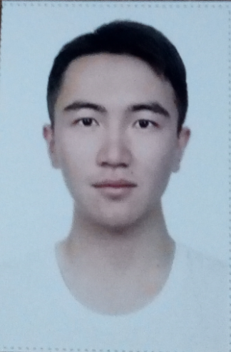

# 实验一：业务流程建模
<table>
<tr>
<td>学号</td>
<td>班级</td>
<td>姓名</td>
<td>照片</td>
</tr>
<tr>
<td>201510414309</td>
<td>15级软件三班</td>
<td>林榆佳</td>
<td></td>
</tr>
</table>

流程图1：考试及成绩管理流程
--------------
plantuml源码如下:
```
@startuml
|教务处|
start
:安排考试;
:考试安排表]
|教师|
:出卷;
fork
:A/B试卷]
fork again
:打印审批表]
|系主任|
:审批签字;
:打印审批表]
end fork
|教务处|
:打印试卷;
:试卷]
|学生|
:参加考试;
:答卷]
|教师|
:阅卷出成绩;
fork
:成绩单;
|教务处|
:有不及格;
:安排补考;
:补考安排表;


fork again
|教师|
:答卷]
:装订存档;
end fork
|教师|
:期末流程结束;
stop
@enduml
```
业务流程图:


流程说明：

流程图用泳道分为教务处，教师，系主任和学生，教务处负责安排考试设计考试安排表，打印试卷
教师在考试安排表出来后进行出卷和打印审批表，系主任审批签字，打印审批表，学生在试卷出来
后参加考试进行答卷，由老师阅卷出成绩后给出成绩单，并将答卷装订存档，若有不及格，由教务
处安排补考，给出补考安排表，期末流程到此结束。

流程图2:客户维修服务流程
=============
plantuml源码如下：
```
@startuml
|客户|
start
:申请服务;
|业务经理|
if(是新客户吗？)then(yes)
:登记客户信息;
:上门勘察;
else(no)
:上门勘察;
endif
:制定方案;
|客户|
if(满意与否？)then(yes)
:签订合同;
|业务经理|
fork
:安排工人;
fork again
:安排材料;
end fork
:填写派工单;
|工人|
:领取材料;
:上门服务;
|客户|
:验收并填写反馈意见;
|业务经理|
:交回派工单;
|财务人员|
:结算收款;
stop
else(no)
|客户|
stop
endif

@enduml
```
业务流程图如下:


流程说明:

该业务流程由泳道分为客户，业务经理，工人和财务人员四部分，客户申请服务后，由业务经理判断
是否为新客户，是新客户则登记客户信息并上门勘察，不是新客户就直接上门勘察，然后制定相应方
案，客户满意后签订合同，由业务经理安排工人，安排材料，各方面到位后填写派工单，工人领取材
料后进行上门服务，然后客户验收并填写反馈信息，然后业务经理交回派工单，最后财务人员结算收款。
