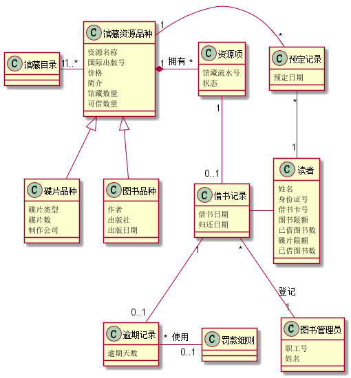
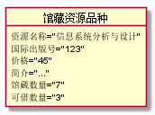
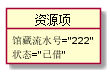
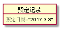
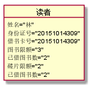
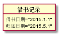
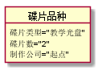
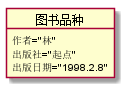
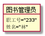

# 实验3：图书管理系统领域对象建模
<table>
<tr>
<td>学号</td>
<td>班级</td>
<td>姓名</td>
<td>照片</td>
</tr>
<tr>
<td>201510414309</td>
<td>15级软件三班</td>
<td>林榆佳</td>
<td></td>
</tr>
</table>

##  1. 图书管理系统的类图

### 1.1 类图PlantUML源码如下：

``` class
@startuml
馆藏目录"1"-"1...*"馆藏资源品种
馆藏资源品种"1"-"*"预定记录
馆藏资源品种"1"*-"*"资源项:拥有
馆藏资源品种<|--碟片品种
馆藏资源品种<|--图书品种
资源项"1"--"0..1"借书记录
借书记录"*"--"1"图书管理员:登记
借书记录"1"--"0..1"逾期记录
借书记录-读者
预定记录"*"--"1"读者
逾期记录"*"-"0..1"罚款细则:使用

class 馆藏资源品种{
   资源名称
   国际出版号
   价格
   简介
   馆藏数量
   可借数量
}

class 碟片品种{
   碟片类型
   碟片数
   制作公司
}

class 图书品种{
   作者
   出版社
   出版日期
}

class 预定记录{
   预定日期
}

class 资源项{
   馆藏流水号
   状态
}

class 借书记录{
   借书日期
   归还日期
}

class 读者{
   姓名
   身份证号
   借书卡号
   图书限额
   已借图书数
   碟片限额
   已借图书数

}

class 图书管理员{
   职工号
   姓名
}

class 逾期记录{
   逾期天数
}
@enduml
```

### 1.2. 类图如下：




### 1.3. 类图说明：
此图说明了图书馆的馆藏书籍的相关信息以及馆藏碟片的相关信息，
对于图书管理系统的读者身份信息和技术相关信息也有详细描述，还
包括了图书管理员的相关信息。

## 2. 图书管理系统的对象图
### 2.1 馆藏资源品种的对象图
#### 源码如下：
``` class
@startuml
object 馆藏资源品种{
 资源名称="信息系统分析与设计"
 国际出版号="123"
 价格="45"
 简介="..."
 馆藏数量="7"
 可借数量="3"
 }
@enduml
```
#### 对象图如下：


### 2.2 资源项的对象图
#### 源码如下：
``` class
@startuml
object user2 {
name = "Dummy"
id = 123
}
@enduml
```
#### 对象图如下：


### 2.3 预定记录的对象图
#### 源码如下：
``` class
@startuml
object 预定记录{
  预定日期="2017.3.3"
}
@enduml
```
#### 对象图如下：


### 2.4 读者的对象图
#### 源码如下：
``` class
@startuml
object 读者{
   姓名="林"
   身份证号="20151014309"
   借书卡号="20151014309"
   图书限额="3"
   已借图书数="2"
   碟片限额="2"
   已借图书数="2"

}
@enduml
```
#### 对象图如下：


### 2.5借书记录的对象图
#### 源码如下：
``` class
@startuml
object 借书记录{
   借书日期="2015.1.1"
   归还日期="2015.5.1"
}
@enduml
```
#### 对象图如下：


### 2.6 读者的对象图
#### 源码如下：
``` class
@startuml
object 碟片品种{
    碟片类型="教学光盘"
    碟片数="2"
    制作公司="起点"
}
@enduml
```
#### 对象图如下：


### 2.7 图书品种的对象图
#### 源码如下：
``` class
@startuml
object 图书品种{
    作者="林"
    出版社="起点"
    出版日期="1998.2.8"
}
@enduml
```
#### 对象图如下：


### 2.8 图书管理员的对象图
#### 源码如下：
``` class
@startuml
object 图书管理员{
    职工号="233"
    姓名="林"
}
@enduml
```
#### 对象图如下：
