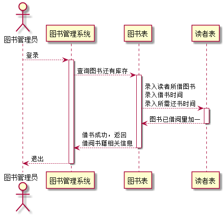
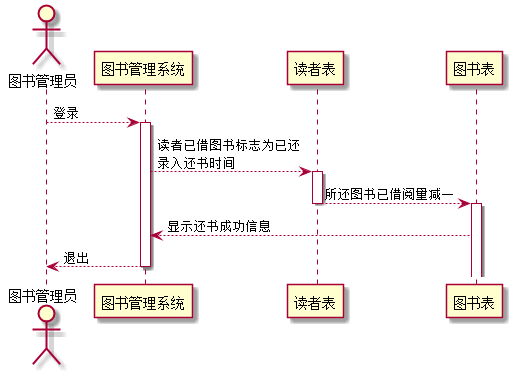
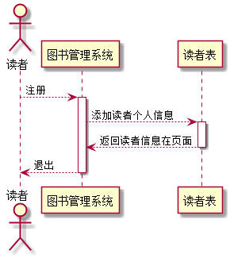
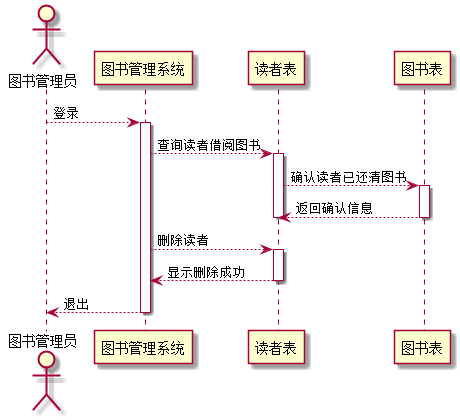
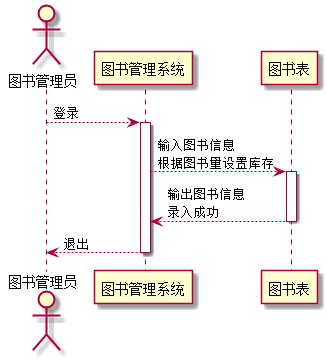
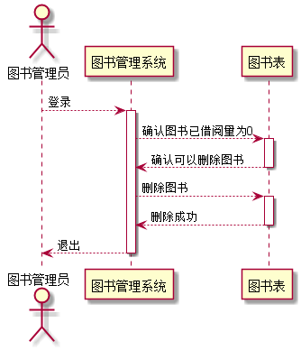
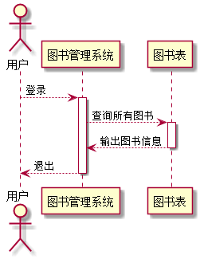
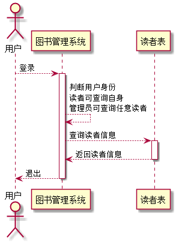
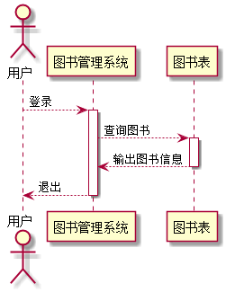

# 实验4：图书管理系统的顺序图
<table>
<tr>
<td>学号</td>
<td>班级</td>
<td>姓名</td>
<td>照片</td>
</tr>
<tr>
<td>201510414309</td>
<td>15级软件三班</td>
<td>林榆佳</td>
<td></td>
</tr>
</table>

##  1. 借书顺序图

### 1.1 借书顺序图图PlantUML源码如下：

``` class
@startuml
 actor 图书管理员
 participant "图书管理系统" as A
  participant "图书表" as B
   participant "读者表" as C
 图书管理员-->A:登录
 activate A
 A-->B:查询图书还有库存
 activate B
B-->C:录入读者所借图书\n录入借书时间\n录入所需还书时间
activate C
C-->B:图书已借阅量加一
deactivate C
B-->A:借书成功，返回\n借阅书籍相关信息
deactivate B
A-->图书管理员:退出
deactivate A
```

### 1.2. 借书顺序图如下：



### 1.3. 借书顺序图说明：
图书馆借书操作是由管理员来完成的，读者只有查看图书的权限。
##  2. 还书顺序图

### 2.1 还书顺序图图PlantUML源码如下：

``` class
@startuml
@startuml
 actor 图书管理员
 participant "图书管理系统" as A
  participant "读者表" as C
  participant "图书表" as B

 图书管理员-->A:登录
 activate A
 A-->C:读者已借图书标志为已还\n录入还书时间
 activate C
C-->B:所还图书已借阅量减一
deactivate C
activate B
B-->A:显示还书成功信息
deactivate C
A-->图书管理员:退出
deactivate A
@enduml
```

### 2.2. 还书顺序图如下：


### 2.3. 还书顺序图说明：
还书操作也由管理员执行。

##  3. 读者注册

### 3.1 读者注册顺序图PlantUML源码如下：

``` class
@startuml
 actor 读者
 participant "图书管理系统" as A
   participant "读者表" as B
 读者-->A:注册
 activate A
 A-->B:添加读者个人信息
 activate B
 B-->A:返回读者信息在页面
 deactivate B
A-->读者:退出
deactivate A
@enduml
```

### 3.2. 读者注册顺序图如下：


### 3.3.读者注册顺序图说明：
读者的注册由自己完成，注册成功后会自动设置借阅量为0.

##  4. 删除读者顺序图

### 4.1删除读者顺序图PlantUML源码如下：

``` class
@startuml
 actor 图书管理员
 participant "图书管理系统" as A
  participant "读者表" as B
   participant "图书表" as C
 图书管理员-->A:登录
 activate A
 A-->B:查询读者借阅图书
 activate B
B-->C:确认读者已还清图书
activate C
C-->B:返回确认信息
deactivate B
deactivate C
A-->B:删除读者
activate B
B-->A:显示删除成功
deactivate B
A-->图书管理员:退出
deactivate A
@enduml
```

### 4.2. 删除读者顺序图如下：



### 4.3.删除读者顺序图说明：
删除读者只能由管理员执行，在删除之前要先确认读者所借图书已经全部还齐，然后才能删除读者。

##  5. 录入图书顺序图

### 5.1  录入图书顺序图PlantUML源码如下：

``` class
 actor 图书管理员
 participant "图书管理系统" as A
  participant "图书表" as B

 图书管理员-->A:登录
 activate A
 A-->B:输入图书信息\n根据图书量设置库存
 activate B
 B-->A:输出图书信息\n录入成功
 deactivate B
A-->图书管理员:退出
deactivate A
```

### 5.2.  录入图书顺序图如下：


### 5.3. 录入图书顺序图说明：
图书的录入由管理员进行，设置初始借阅量为0。

##  6. 删除图书顺序图

### 6.1删除图书顺序图PlantUML源码如下：

``` class
@startuml
 actor 图书管理员
 participant "图书管理系统" as A
  participant "图书表" as B

 图书管理员-->A:登录
 activate A
 A-->B:确认图书已借阅量为0
 activate B
 B-->A:确认可以删除图书
 deactivate B
 A-->B:删除图书
  activate B
  B-->A:删除成功
  deactivate B
A-->图书管理员:退出
deactivate A
@enduml
```

### 6.2. 删除图书顺序图如下：



### 6.3.删除图书顺序图说明：
删除图书要确认图书没有借出图书才能删除，这样利于归档。

##  7. 查看所有图书顺序图

### 7.1查看所有图书顺序图PlantUML源码如下：

``` class
@startuml
 actor 用户
 participant "图书管理系统" as A
  participant "图书表" as B
用户-->A:登录
 activate A
 A-->B:查询所有图书
 activate B
 B-->A:输出图书信息
 deactivate B
A-->用户:退出
deactivate A
@enduml
```

### 7.2.  查看所有图书顺序图如下：


### 7.3. 查看所有图书顺序图说明：
读者和管理员都能查看所有图书，以分页查询的方式展示。

##  8. 查询读者信息顺序图

### 8.1 查询读者信息顺序图PlantUML源码如下：

``` class
@startuml
 actor 用户
 participant "图书管理系统" as A
   participant "读者表" as B
用户-->A:登录
activate A
A-->A:判断用户身份\n读者可查询自身\n管理员可查询任意读者
A-->B:查询读者信息
activate B
B-->A:返回读者信息
deactivate B
A-->用户:退出
deactivate A
@enduml
```

### 8.2.  查询读者信息顺序图如下：


### 8.3. 查询读者信息顺序图说明：
读者信息读者能查看自身信息，管理员可查询任意读者信息。

##  9. 查看单个图书顺序图

### 9.1查看单个图书顺序图PlantUML源码如下：

``` class
@startuml
 actor 用户
 participant "图书管理系统" as A
  participant "图书表" as B
用户-->A:登录
 activate A
 A-->B:查询单个图书
 activate B
 B-->A:输出图书信息
 deactivate B
A-->用户:退出
deactivate A
@enduml
```

### 9.2.  查看单个图书顺序图如下：


### 9.3. 查看单个图书顺序图说明：
读者和管理员都能查询单个图书，借阅量及相关信息


