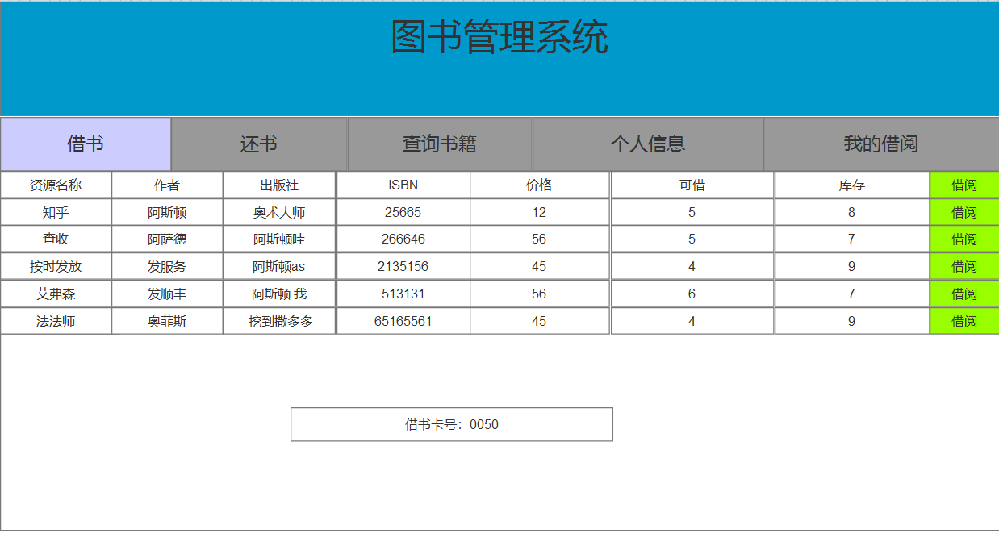
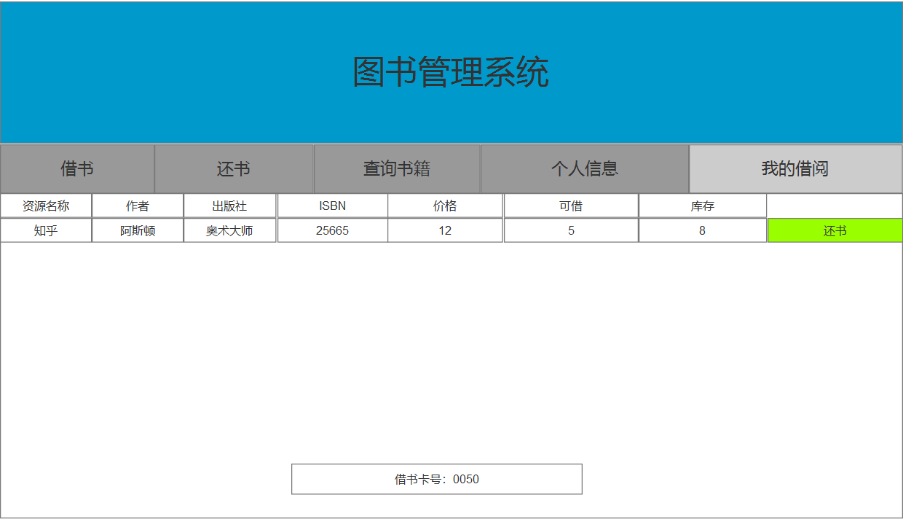
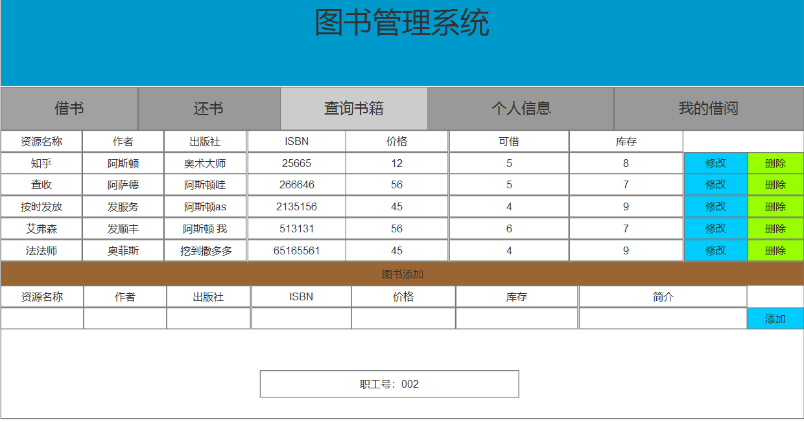

# 实验5：图书管理系统数据库设计与界面设计

<table>
<tr>
<td>学号</td>
<td>班级</td>
<td>姓名</td>
<td>照片</td>
</tr>
<tr>
<td>201510414309</td>
<td>15级软件三班</td>
<td>林榆佳</td>
<td></td>
</tr>
</table>

## 1.数据库表设计
### 1.馆藏资源表
|    字段   |      类型       |      主键，外键    |      可以为空    |      默认值    |      约束    |      说明    |
|:--------:|:------------- |:----------------|:---------------|:-------------|:-----------|:-----------|
|    ISBN   |   varchar(20)   |       主键        |         否       |                |             |  国际出版号  |
|     Name  |   varchar(40)   |                   |         否       |                |             |   资源名称    |
|   author  |   varchar（8）  |                   |         否       |                |             |      作者    |
| publisher |   varchar（20） |                   |         否       |                |             |     出版社   |
|   price   |     Double      |                   |         否       |       0.00     |             |       价格   |
|    cunm   |     integer     |                   |         否       |       0        |             |     库存量   |
|    snum   |      integer    |                   |         否       |       默认为库存值       |             |    可借 量   |
|   summary |   varchar(200)  |                   |         否       |                |             |    内容描述  |


### 2.借书表
|    字段   |      类型       |      主键，外键    |      可以为空    |      默认值    |      约束    |      说明    |
|:--------:|:------------- |:----------------|:---------------|:-------------|:-----------|:-----------|
|  bookId   |   varchar(10)   |          主键     |         否       |                |             | 馆藏流水号   |
|  readerId |   varchar(8)    |       外键        |         否       |                |             |     读者号   |
|    ISBN   |   varchar(20)   |                   |         否       |                |             |  国际出版号  |
|   ltime   |      date       |                   |         否       |                |             |    借书时间  |
|   lday    |      date       |                   |         否       |                |             |预计还书时间  |

### 3.还书表
|    字段   |      类型       |      主键，外键    |      可以为空    |      默认值    |      约束    |      说明    |
|:--------:|:------------- |:----------------|:---------------|:-------------|:-----------|:-----------|
|  bookId   |   varchar(10)   |          主键     |         否       |                |             | 馆藏流水号   |
|  readerId |   varchar(8)    |       外键        |         否       |                |             |     读者号   |
|    ISBN   |   varchar(20)   |                   |         否       |                |             |  国际出版号  |
|  lentime  |      date       |                   |         否       |                |             |    还书时间  |

### 4.员工表
|    字段   |      类型       |      主键，外键    |      可以为空    |      默认值    |      约束    |      说明    |
|:--------:|:------------- |:----------------|:---------------|:-------------|:-----------|:-----------|
|     id    |   integer       |       主键        |         否       |                |             |      职工id  |
|     name  |   varchar(20)   |                   |         否       |                |             |    职工姓名  |
|  password |   varchar(20)   |                   |         否       |                |             |     密码     |

### 5.读者表
|    字段   |      类型       |      主键，外键    |      可以为空    |      默认值    |      约束    |      说明    |
|:--------:|:------------- |:----------------|:---------------|:-------------|:-----------|:-----------|
|  readerId |   varchar(8)   |       主键        |         否       |                |             |   借书卡号    |
|     name  |   varchar(8)   |                   |         否       |                |             |      姓  名  |
|     bnum  |  integer       |                   |         否       |       0        |             |   图书限额    |
|     blen  |     integer    |                   |         否       |       0        |             |  已借图书数   |
|     dinum |   integer      |                   |         否       |       0        |             |  碟片限额     |
|  diken    |      integer   |                   |         否       |       0        |             | 已借碟片数    |
### 6.逾期记录表
|    字段   |      类型        |      主键，外键    |      可以为空    |      默认值   |      约束    |      说明    |
|:--------:|:------------- |:----------------|:---------------|:-------------|:-----------|:-----------|
|    outid  |     integer     |          主键      |        否       |                |             |    逾期记录id|
|readerid   | varchar(8)      |     外键          |          否      |                |             |  借书卡号    |
|    ISBN   |   varchar(20)   |       外键        |         否       |                |             |  国际出版号  |
|  bookId   |   varchar(10)   |          外键     |         否       |                |             | 馆藏流水号   |
|   ltime   |      date       |                   |         否       |                |             |    借书时间  |
|   lday    |      date       |                   |         否       |                |             |预计还书时间  |

## 2.界面设计
### 2.1 借书界面设计


* 用例图参见：借书用例
* 类图参见：读者类，馆藏资源类，借书类
* 顺序图参见：借书顺序图
* API接口如下：
1.获取图书信息
* 功能：用于显示全部可借阅书籍
* 请求地址：http://libTest/v1/api/lend
* 请求方法：post
* 请求参数

 |       参数名称     |    必填   |    说明    |
 |:--------------- |:----------|:---------|
 |    readerid       |      是    | 借书卡号，用于在借书时绑定用户  |
 |    bookid         |      是    |  馆藏流水号，借书时录入书籍，一书一号 |
* 返回实例
 ```
 {
     {
   "info":借书成功
    "data": [{
    "ISBN":25665
     "Name":知乎
     "author":阿斯顿
     "publisher":奥术大师
     "price":12.00
     "cnum"：5
     "snum":8
     "readerid":00050
     "bookid":01
     "ltime":2017-7-8 13:00:20
     "lday":2017-9-8 13:00:20
     }
     ];
      "totalNum":"9",

            }
 }
 ```
 * 返回参数说明

  |       参数名称     |    说明    |
  |:--------------- |:---------|
  |        ISBN       | 国际出版号  |
  |    bookid         |    馆藏流水号 |
  |       name        |      馆藏资源名称    |
  |       author      |        作者            |
  |     publisher     |       出版社          |
  |       price       |      价格            |
  |       cnum        |       可借量减一         |
  |       snum        |     库存            |
  |       summary     |      内容            |
  |      ltime        |     借书时间            |
  |       lday        |     预计还书时间           |
    |   totalNum   |  总数据数     |
       |   info   |   返回结果说明信息     |


2.2 还书界面设计



* 用例图参见：还书用例
* 类图参见：读者类，馆藏资源类，还书类
* 顺序图参见：还书顺序图
* API接口如下：
1.还书
* 功能：用于归还图书
* 请求地址：http://libTest/v1/api/back
* 请求方法：post
* 请求参数

 |       参数名称     |    必填   |    说明    |
 |:--------------- |:----------|:---------|
 |    readerid       |      是    | 借书卡号，用于在还书时绑定用户  |
 |    bookid         |      是    |  馆藏流水号，还书时录入书籍，一书一号 |
* 返回实例
 ```
 {
     {
   "info":还书成功
    "data":[
    {
    "ISBN":25665
     "Name":知乎
     "author":阿斯顿
     "publisher":奥术大师
     "price":12.00
     "cnum"：5
     "snum":8
     "readerid":00050
     "bookid":01
     "ltime":2017-7-8 13:00:20
     "lday":2017-9-8 13:00:20
     }
     ];
      "totalNum":"9",

                 }
 }
 ```
 * 返回参数说明

  |       参数名称     |    说明    |
  |:--------------- |:---------|
  |        ISBN       | 国际出版号  |
  |    bookid         |    馆藏流水号 |
  |       name        |      馆藏资源名称    |
  |       author      |        作者            |
  |     publisher     |       出版社          |
  |       price       |      价格            |
  |       cnum        |       可借量          |
  |       snum        |     库存            |
  |       summary     |      内容            |
  |      ltime        |     借书时间            |
  |       lday        |     预计还书时间           |
  |      lentime      |       还书时间  |
    |   totalNum   |  总数据数     |
       |   info   |   返回结果说明信息     |


 2.3 图书管理界面设计

 

 * 用例图参见：图书管理用例
 * 类图参见：馆藏资源类
 * 顺序图参见：图书修改顺序图，图书删除顺序图，图书增加顺序图
 * API接口如下：
 1.图书修改
 * 功能：用于修改图书数据
 * 请求地址：http://libTest/v1/api/bookmanager
 * 请求方法：post
 * 请求参数

  |       参数名称     |    必填   |    说明    |
  |:--------------- |:----------|:---------|
  |        ISBN       |     否    |  新的国际出版号  |
  |    bookid         |     是    |  馆藏流水号，修改书籍信息按此查询要修改的书籍 |
  |       name        |    否     |    新的馆藏资源名称    |
  |       author      |    否     |    新的作者            |
  |     publisher     |    否     |    新的出版社          |
  |       price       |    否     |    新的价格            |
  |       cnum        |    否     |    新的可借量          |
  |       snum        |    否     |    新的库存            |
  |       summary     |    否     |    新的内容            |
 * 返回实例
  ```
  {

     {
    "info":修改成功
     "data":[
     {
     "ISBN":25665
      "Name":知乎
      "author":阿斯顿
      "publisher":奥术神座
      "price":12.00
      "cnum"：5
      "snum":8
      "id":002
      "bookid":01
      }
      ];
       "totalNum":"1",

                  }
  }
  ```
  * 返回参数说明

    |       参数名称     |     说明    |
    |:--------------- |:---------|
    |        ISBN       |      新的国际出版号  |
    |    bookid         |      馆藏流水号，修改书籍信息按此查询要修改的书籍 |
    |       name        |   新的馆藏资源名称    |
    |       author      |  新的作者            |
    |     publisher     |     新的出版社          |
    |       price       |    新的价格            |
    |       cnum        |      新的可借量          |
    |       snum        |     新的库存            |
    |       summary     |      新的内容            |
    |       id        |      职工号，登录时用session保存            |
     |   totalNum   |  总数据数     |
     |   info   |   返回结果说明信息     |

  2.图书删除
   * 功能：用于修改图书数据
   * 请求地址：http://libTest/v1/api/bookmanager
   * 请求方法：post
   * 请求参数

  | 参数名称 |  必填 | 说明 |
  |:-------- |:-------- |:-------- |
  |    bookid         |     是    |  馆藏流水号，按此删除书籍 |

   * 返回实例

    {
    {
      "info":删除成功
      "data":[
      {
          "id":002
      }
      ];
       "totalNum":"1"

        }
    }
     ```
   * 返回参数说明

     | 参数名称 |  必填 | 说明 |
     |:-------- |:-------- |:-------- |
      |       id        |      职工号，登录时用session保存            |
         |   info   |   返回结果说明信息     |
 |   totalNum   |  总数据数     |
 |   info   |   返回结果说明信息     |

  1.图书增加
  * 功能：用于添加图书数据
  * 请求地址：http://libTest/v1/api/bookmanager
  * 请求方法：post
  * 请求参数

   |       参数名称     |    必填   |    说明    |
   |:--------------- |:----------|:---------|
   |        ISBN       |     是    |  新的国际出版号  |
   |    bookid         |     是    |  新的馆藏流水号  |
   |       name        |    是     |    新的馆藏资源名称    |
   |       author      |    是    |    新的作者            |
   |     publisher     |    是     |    新的出版社          |
   |       price       |    是     |    新的价格            |
   |       cnum        |    是     |     可借量默认为库存          |
   |       snum        |    是     |    新的库存            |
   |       summary     |    是     |    新的内容            |
  * 返回实例
   ```
   {
      {
     "info":添加成功
           "data":[{
               "id":002
           }];

            "totalNum":"1",

                       }


   }
   ```
* 返回参数说明

     | 参数名称 |  说明 |
     |:-------- |:-------- |
      |    id    |    职工号，登录时用session保存     |
       |   info   |   返回结果说明信息     |
        |   totalNum   |  总数据数     |


