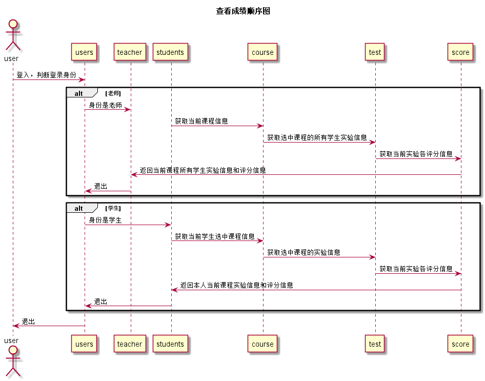

# “查看成绩”用例 [返回](../Readme.md)
## 1. 用例规约

|用例名称|查看成绩|
|-------|:-------------|
|功能|学生查看自己的每个实验的实验成绩及实验评价|
|参与者|学生|
|前置条件|学生需要先登录|
|后置条件| |
|主事件流| |
|备选事件流| |

## 2. 业务流程（顺序图） [源码](../src/查看成绩.puml)

## 3. 界面设计
- 界面参照: https://jiaou.github.io/is_analysis/test6/ui/查看成绩.html
- API接口调用
    - 接口1：[getOneStudentResults](../接口/getOneStudentResults.md)

     用于设置一个学生的部分实验成绩和评语

   - 接口2：[getCourse](../接口/getCourse.md)

     用于取得老师所教课程号，不同课程号的课程学生不同，学期不同

## 4. 算法描述
    无

## 5. 参照表
- [STUDENTS](../数据库设计.md/#STUDENTS)
- [SCORE](../数据库设计.md/#SCORE)
- [TESTS](../数据库设计.md/#TESTS)
- [COURSSTU](../数据库设计.md/#COURSESTU)
- [COURSETEACH](../数据库设计.md/#COURSETEACH)